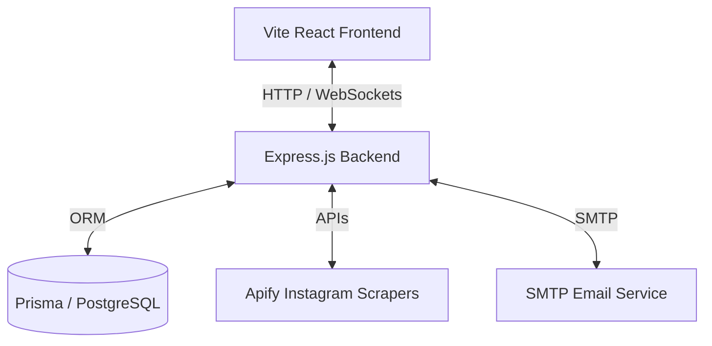
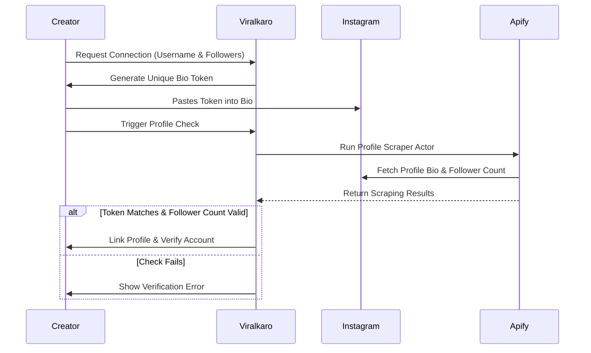
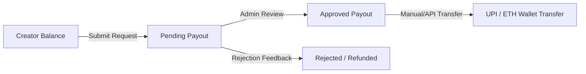

# Viralkaro 🚀

Viralkaro is a performance-based creator marketing platform that rewards creators for driving organic views on short-form videos (clippings/Reels). The platform connects creators with brand campaigns, automates video analytics tracking, and simplifies performance-based payouts.

---

## 1. System Architecture

The platform operates on a split-application structure:



*   **Frontend (Client):** A single-page application built with React, TypeScript, and Vite. It serves three distinct user interfaces: the **Creator Dashboard**, **Admin Panel**, and **Superadmin Controls**.
*   **Backend (Core Services):** An Express.js REST API that handles auth/OTP verification, campaign management, support chat (Socket.io), and metrics synchronization.
*   **Database (Persistence):** Prisma ORM with PostgreSQL storing users, connection logs, submissions, and payout structures.
*   **Data Fetching (Scraper Integration):** Synchronous and asynchronous Apify actors that scrape public Instagram metrics without requiring user Instagram logins.

---

## 2. Product Lifecycles & Workflows

### A. Creator Onboarding & Instagram Verification
To maintain platform integrity, Viralkaro verifies creator profiles and follower counts through a secure verification handshake:



### B. Campaign & Submission Lifecycle
Brands and admins host marketing campaigns on Viralkaro. Creators submit clipping reels to earn performance rewards:

1.  **Campaign Curation:** Admins create campaigns with specific rules, category guidelines, max earnings caps, and dynamic reward rates (e.g. INR per 1,000 views).
2.  **Reel Submission:** Creators submit the URL of their published Reel. The backend ensures:
    *   The Reel belongs to the connected Instagram account.
    *   The submission is within the active campaign window.
    *   No duplicate URLs are submitted.
3.  **Performance Sync:**
    *   **Realtime Sync:** When a creator requests an update, or when triggered by admins, the system hits Apify's API to fetch the latest view count, play count, comments, and likes.
    *   **Calculated Earnings:** Earnings are computed dynamically: `(Views / 1000) * Campaign Rate`. The total earnings cannot exceed the campaign's `maxEarningRupees`.

### C. Payout Pipeline
All earnings calculations are stored in the database. When creators want to withdraw:



*   **Payment Profiles:** Creators input a UPI ID, phone number, or Ethereum address.
*   **Payout Approval:** Admins view pending payout requests and confirm transactions manually or log transaction hashes.

---

## 3. Core Database Models (Structure)

*   **`User` & `UserRole`:** Handles profile data, status (Active, Paused, Suspended, Banned), and role permissions (`user`, `admin`, `superadmin`).
*   **`InstagramAccount` & `InstagramVerificationRequest`:** Stores linked creator handle analytics (followers count, verification state, temporary tokens).
*   **`Campaign`:** Defines active brand campaigns, rules, banners, budgets, and pay rates.
*   **`Submission`:** Connects users to campaigns, caching live metrics (views, comments, likes) and calculated earnings.
*   **`PaymentProfile` & `PayoutRequest`:** Handles payment destination info and withdrawal histories.
*   **`SupportMessage` & `Notification`:** Handles user-admin chat rooms and notifications.

---

## 4. Local Development Structure

### Directory Structure
```text
insta-boost-co/
├── src/                      # Frontend Application (React, Tailwind, Shadcn)
│   ├── components/           # UI elements (Cards, Buttons, Lists)
│   ├── hooks/                # Data queries & state controllers
│   ├── lib/                  # Socket.io Client & API fetchers
│   └── pages/                # Views (Dashboard, Campaign details, Admin view)
├── backend/                  # Backend Application (Express.js, Prisma)
│   ├── src/
│   │   ├── config/           # Environment validators (Zod validation)
│   │   ├── lib/              # Database wrappers, Session engines, Passwords
│   │   ├── routes/           # REST APIs (Auth, Submissions, Campaigns)
│   │   └── scripts/          # Seeding & DB backfills
│   └── prisma/               # Schema configuration & SQL migrations
├── seed.ts                   # Reference seed data
└── README.md                 # System overview (this file)
```

### Quick Start
1.  **Frontend Config:** Create `.env` in the root folder:
    ```env
    VITE_API_URL="http://localhost:4000"
    ```
2.  **Backend Config:** Create `backend/.env` containing:
    *   `DATABASE_URL` (PostgreSQL connection URL)
    *   `SESSION_SECRET` (Secure cookie signature)
    *   `FRONTEND_ORIGIN="http://localhost:8080"`
    *   `APIFY_API_TOKEN` (Scraping engine key)
3.  **Run Applications:**
    *   **Backend:** Navigate to `backend`, run `npm install`, then `npm run prisma:generate`, and start with `npm run dev`.
    *   **Frontend:** Navigate to the root, run `npm install`, then start with `npm run dev`.

---

## 5. Pre-configured Seed Accounts

To log in and test different user interfaces, run `npm run seed` in the `backend` folder. This generates the following test roles:

*   **Superadmin:** `superadmin@viralkaro.local` (Password: `SuperAdmin@123`)
*   **Admin:** `admin@viralkaro.local` (Password: `Admin@12345`)
*   **Manager (Admin):** `manager@viralkaro.local` (Password: `Admin@23456`)
*   **Creator:** `creator@viralkaro.local` (Password: `Creator@123`)
*   **Standard Users:** `user1@viralkaro.local`, `user2@viralkaro.local` (Password: `User@12345`, `User@23456`)
